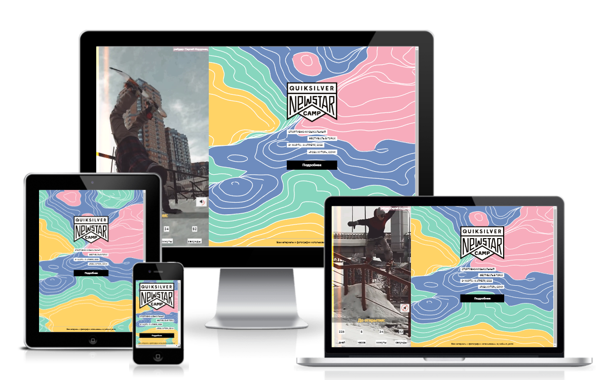

<h1> Сноуборд-контест </h1>
<a href="https://pstnv.github.io/js-snowboard-camp/"> https://pstnv.github.io/js-snowboard-camp </a>

  

 

<h2> О проекте </h2>

 Таймер обратного отсчета до сноуборд-контеста. 

 

<h2> Используемые технологии </h2>

 HTML5 | CSS3 | JavaScript | GSAP

 

<h2>Особенности</h2>
<ul>
  <li> видео с возможностью отключения звука (просто нажмите на иконку мегафона) </li>
  <li> использована анимация для оживления сайта </li>
  <li> сайт адаптирован под мобильные устройства </li>
  <li> все материалы использованы в учебных целях </li>
</ul>
